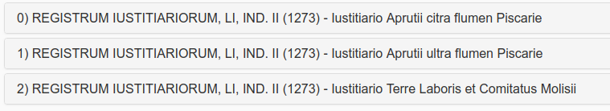

# MaRa v2.0

*Alfredo Cosco*

*alfredo[dot]cosco[at]gmail[dot]com*

[https://github.com/orazionelson](https://github.com/orazionelson)

**MaRa** stands for: **Marcatore dei Registri Angioini**

GitHub repository: https://github.com/angioXML/MaRa2

This software is part of a project of [**University of Napoli "Federico II"**](http://www.unina.it), that aims to build an XML archive, a database and a search tool for the **Southern Italian Angevine Canchery Papers**.

## A short historical intro
During the World War II, at the end of September 1943, a German army troop retreating from southern Italy burned the *Angevine Canchery Archive of Naples Kingdom*. The papers were hosted, for safety reasons, in a village, **San Paolo Belsito**, about 30km far from their building in Naples (then almost daily bombed by the Allies). The German retaliation destroyed thousands of folders containing parchments from the 13th to the 15th century.

After the war, the archivists of **Archivio di Stato di Napoli**, leaded by Riccardo Filangieri, went in search of the transcripts of the lost acts, administrative and political, which had been made over the centuries by archivists, scholars and historians. Then, they started to rebuild the archive in printed volumes. The reconstruction work continues today, it reached the number of 50 volumes and it covers a range of years from 1265 to 1434, under the main title: **I Registri della Cancelleria Angioina**.

## Software Dev for Angevine Canchery Papers in XML

Since 2004, Prof. Roberto Delle Donne, from *University of Napoli "Federico II"*, managed for a digital edition of the **Angevine Canchery sources**, with the aim to realize a research tool accessible through a web interface.

I was involved, as a student of Arts and Licterature and worker in IT, at the early stages of the project.

Focusing on available options XML appeared as the most suitable format to store the data, then a DTD was defined by Dott. Manuela Schiano. According to the DTD each XML had to be structured  in three parts:

- document metadata
- document content
- editing data

The **content** was structured in: PROTOCOLLO, TESTO and ESCATOCOLLO, that are the three main portions of a medieval document. Inside the document content each part contains children defined with the names of diplomatic: INSCRIPTIO, DATATIO, SANCTIO...

As early transcripts where made by random documents, a series of difficulties arised: 

* slowness to mark-up the documents, 
* different tools used by editors, 
* non-separation of concerns. 

Moreover, the frustration of editing by hands full sets documents repeating tags hundreds of times, or the time spent to debug them when transcribed by other editors, brought to a different approach: 

>**let's start from raw .txt files and automate mark-up as much as possible.**

Then, this target became the object of my degree thesis in Medieval History: Alfredo Cosco, _Critica documentaria e nuove tecnologie. Problemi, tecniche e un caso di studio_, Università degli Studi di Napoli "Federico II", aa 2007-2008.  

**MaRa v1** was a set of unordered [PHP](http://www.php.com)  scripts with a minimal web interface. it was born to transform text transcrips (made in a standard format easier than XML) in well-formed XML. 

**MaRa v2** is its evolution and was used to realize a first heavy draft of our XML repository.

All the scripts were rewritten or nested in [CodeIgniter](https://codeigniter.com/), a good option to add features with little effort, extended by an HMVC CMF called [No-CMS](https://github.com/goFrendiAsgard/No-CMS), really useful and comfortable to build a user interface around the already written functions.

All the functions now are in *models/* and *controllers/* of *mara2/* module.

The new interface integrates an highly customizable text editor like [CodeMirror](https://codemirror.net/) in order to manage everything inside the browser.

There is a dedicated set of regex written for **CodeMirror** to highlight the text files with different colors: useful to check transcript formal errors; it's possible to see them in the file:

>_registridev/modules/mara2/assets/scripts/angevin.js_

The **DTD** has been replaced by an **XSchema**. 

And, that's the most important thing, the job is designed in a flow: 

>from the transcript import  to the export in a set of xml valid documents, eventually packed in a zip file.

## MaRa2 workflow

The starting point is the panel in:

**registridev/mara2/mara2** controller, here you have a TOC based on printed editions designed to manage the flow.

You can create a registry and import the text file.

Then you can **Manage** the registry in 5 steps.

​		

### Few notes about the transcript standard

Each *registry* transcript is made by one *.txt* file, it contains different *partitions*, each partition contains from 1 to n *documents*.

Each partition is separated by the tag: 

		#PARTITION#

The first line after the tag is the **partition title**.

Then the documents.

Each document must have this structure:

		[id]. - [title]
		[text][primary-sources]
		FONTI:[secondary-sources]

The pagination follows the printed text, like this example:

		#PARTITION#
		[partition title]
		[page number]
		[document]
		[document]
		[document]
		[page number]
		[document]
		[document]
		[document]
		... 

So, an end transcrip should look like this:

	#PARTITION#
	REGISTRUM IUSTITIARIORUM, LI, IND. II (1273) - Iustitiario Aprutii citra flumen Piscarie
	*RA 11, p. 3
	1. - Pro mictenda pecunia ad Cameram.
	Karolus etc, Phi1ippo de Mondellis Vice Iustitiario Aprutii etc. Cum Nos propter diutinam moram quam in Tuscie partibus traximus magnas subierirnus expensas, et adhuc Nos subire oporteat quousque erimus extra Regnum...Dat. ap. Montemflasconem per Iohannem ven. Panormitanum Archiepiscopum, Regni Sicilie Vice Cancellarium, a. D. MCCLXXIII, die IIII septembris II ind., R. n. a. IX (Reg. 14, f. 172).
	FONTI: Arch. di St. di Napoli, facsim. n. 148; Terlizzi, Documenti delle relazioni tra Carlo I d' Angiò e la Toscana, p. 342, n. 660 (trascriz.); Mirieri Riccio, ms. in Arch., I, f. 347, t (not.); Chiarito, Repertorium 29, f, 219.
	2. -
	(Guillelmum de Grollaio statuit super custodia passuum Aprutii). (Reg. 14, f. 172, t.).
	FONTI: Chiarito, Repertorium 29, f, 219; Durrieu, II, p. 328.	
	...
	...
	#PARTITION#REGISTRUM IUSTITIARIORUM, LI, IND. II (1273) - Iustitiario Aprutii ultra flumen Piscarie
	*RA 11, p. 7
	17. -
	Die Iovis V mensis octubris II ind. ap. Alifiam, de mandato dom. Regis, Iustitiariatus Aprutii divisus est in duas partes, vid. a flumine Piscarie ultra factus est Iustitiarius Egidius de Sancto Liceto miles, cuius commissio inferius denotatur, et citra flumen Piscarie factus est Iustitiarius Petrus de Tyonvilla miles, prout in talibus commissionibus designatur (Reg. 14, f. 179).
	FONTI: Faraglia, Saggio di corografia abruzzese, in Arch. stor. Nap., XVI, p. 735; Giustiniani, Dizionario geografico ragionato del Regno di Napoli, I, p. 119; Camera, Annali, p. 321; Delfico, Dell'Interamnia Pretuzia, p. 31.
	...

### The STEPS

#### Step1a 

This **STEP** splits the entire registry in partitions using the tag **#PARTITION#**. 

The highlighted text in the integrated editor helps to find possible transcript errors.

#### Step1b

Same as before but it adds page numbers to each document 

#### Step2a

This is the **core** of the application, it inherits most of **MaRa1** functions. 
The software splits the partitions in single documents and import them in 4 db tables: 

- **ra_mara_RXX_index**: and index of all registry partitions with their status: 
  - true (for the currrent editing partitions), 
  - false (for the partition to edit), 
  - approved (for the released partitions);
- **ra_mara_RXX_document**: for the document data: Title, Text, Pagenumber; 
- **ra_mara_RXX_regorig**: for the document primary sources; 
- **ra_mara_RXX_source**: for the document secondary sources.

*(where XX is the registry id number)*

At the top of the page there is an **Info Panel** that works as a first error control:

> if the 3 numbers in the panel are the same everything is going good otherwise there's something wrong in the transcript

Each document is analyzed in the tabs at the middle the page. 

	

The software normalizes the most common errors appeared in editing using **regular expressions**. Sometimes it correct them, in other cases it shows a error message. 

**Sample error:** in the next image the document title has not beed separated by the text.

	

Is possible correct the error in the integrated editor.

	

**Sample error:** in the next image the software alerts for a a leak of page number.

	

**Sample error correction:** in the next image the software advises for an autocorrection.

**Sample Corrections**: in the next image the software advises you and correct the notation *ibidem* taking the info from the previous record.

The tab for the secondary sources, called **Fonti**, will split and normalize them. 

See in the next image that the notation  *Ms. Bibl. Naz* changes to *Biblioteca Nazionale di Napoli, ms.*

It is possible to edit the transformation db from the sub-tab **Casistica di trasformazione**

Sometimes the splitted vision of the sources shows you that something is wrong, see the next image:

Once there are no more errors it is possible to click on the button **Approva** to release the partition. 

This will lock the partition and will unlock the next one.

When all partitions are released, on the page appears the **Crea XML** that leads you to the next step.
 		

#### Step3a

This step transforms the records in XML files.

#### Step3b

The last step is dedicated to validate the XML.
It is possible validate the entire transcription or the single document.

Then at the bottom of this interface is possible to pack each generate regisin a zip file or create a TOC of them.

The workflow is strictly connected with the filesystem organization inside the directory:
* *mara_folders/* 

the sub-directories:

* *00_originali/* Contains the original transcripts  
* *01_trascrizioni/* Contains the transcript at step1  
* *02_tocpic/* Contains the images with the TOC of each transcript  
* *03_xml/* Contains the generated XML documents  
* *04_zip/* Contains the zipped folders with documents  
* *05_rollback_files/* Transcript txt files regenerated from the DB during the flow if needed by the editors for further corrections  
* *06_toc/* Contains a useful toc of generated documents    
* *maradb/* Contains a text-db used for the sources normalization process

At the end of the flow XML files will be stored in **03_xml/**. 

## Targets

Almost the half of the entire documents set edited in **I Registri della Cancelleria Angioina** has been tranformed to XML using MaRa v1 and v2.

Moreover, the design of the project, bring more counsciousness about how to: 

> **design an editing infrastructure based on XML but dedicated to people that has to practice XML as less as possible**.

The know-how and the files were transfered in the new project based on [xquery](https://www.w3.org/XML/Query/) and [eXist-db](http://exist-db.org).

## Notes about the software installation for testing

**MaRa2** is designed for a localhost use, moreover its specifical features make its use for a different project a *nonsense*, anyway, its installation and use comes as common CMS in a [LAMP](https://en.wikipedia.org/wiki/LAMP_(software_bundle)) environment:

- unzip the package to your apache web-server, so your path will be: http://localhost/registridev
- import the **registridev.sql.gz** file in a MySql table called: *registridev*
- set the CodeIgniter config files, as any CI application, with you server and mySql data
- set the *registridev/* directory (and everyting inside it) permissions to 777
- log-in on **registridev/main/login** as admin/admin
- test the application, go to **registridev/mara2/mara2**

The package in this repository contains a sample registry (R11) ready for the **STEP2A**, you can try to find and correct some errors then transform it in XML files.

## References

_I registri della Cancelleria Angioina_, Napoli, since 1950 

Riccardo Filangieri, _L'Archivio di Stato di Napoli Durante la Seconda Guerra Mondiale_, Napoli, 1946

Jenkinson, Hilary, Sir & Bell, H. E. (Henry Esmond) & British Committee on the Preservation and Restitution of Works of Art, Archives, and other Material in Enemy Hands (1947). _Italian archives during the war and at its close. H.M.S.O_, London

Commission Internationale de Diplomatique. Comité International des Sciences Historiques, _Vocabulaire International de la Diplomatique_, ed. M. M. CÀRCEL ORTÌ, València 1994 e1997 (2a ediz. corr.).

LAMP: [https://en.wikipedia.org/wiki/LAMP](https://en.wikipedia.org/wiki/LAMP_(software_bundle))

PHP: http://www.php.com

CodeIgniter: http://www.codeigniter.com

jQuery: https://jquery.com/

No-CMS: https://github.com/goFrendiAsgard/No-CMS

CodeMirror: https://codemirror.net/

xquery: https://www.w3.org/XML/Query/

eXist-db: http://exist-db.org